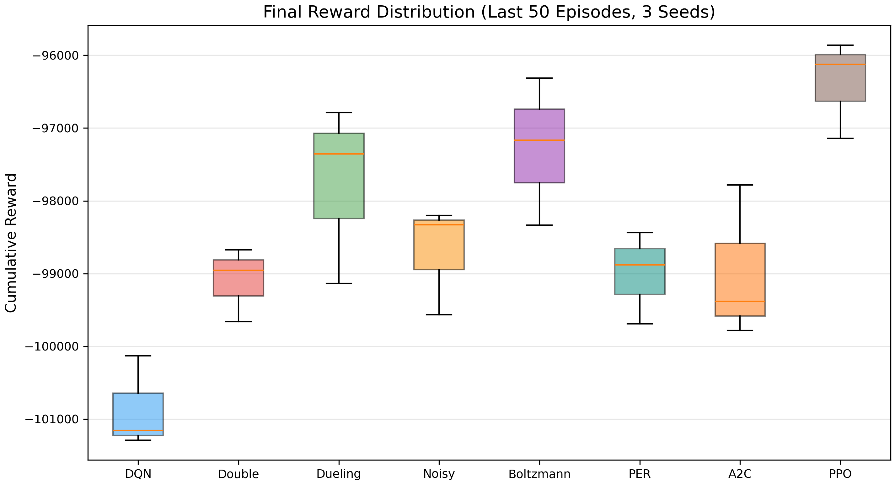
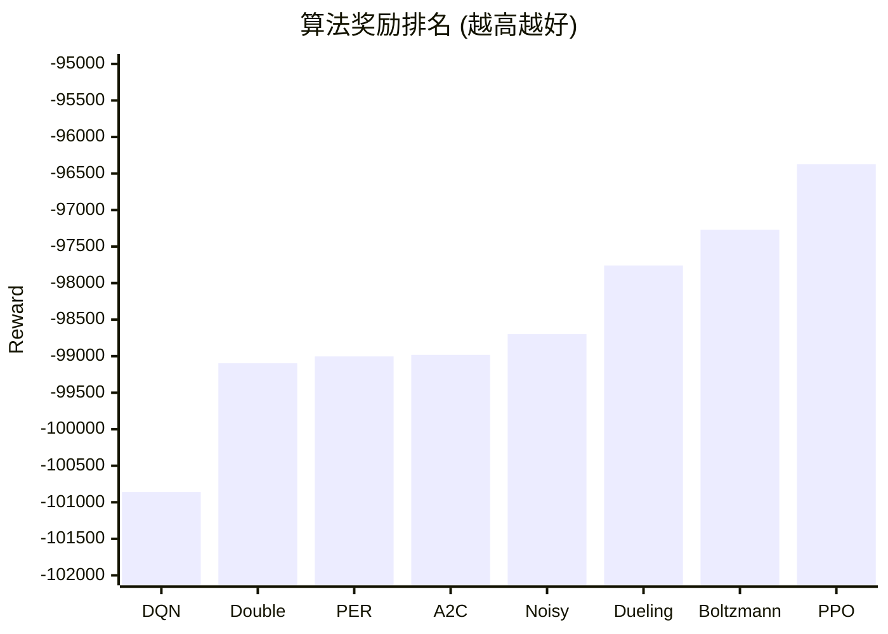
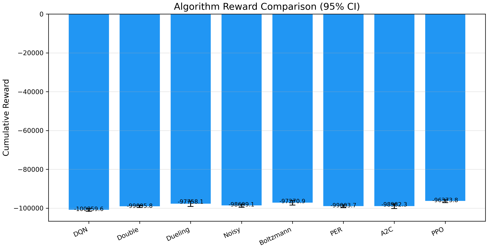
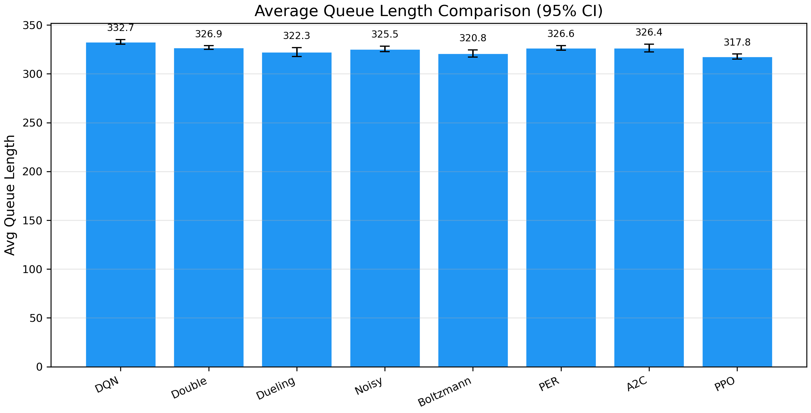
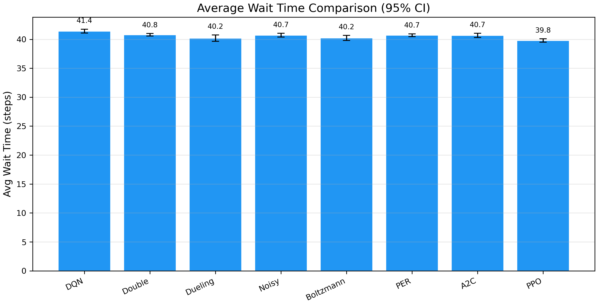
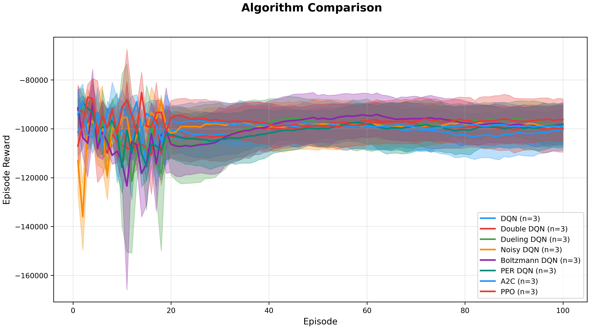
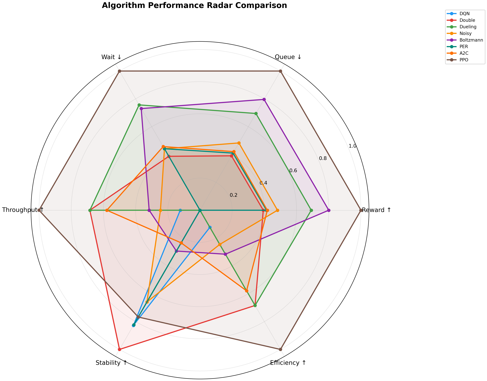

# 交通信号灯自适应控制 — 实验报告

> **实验日期**: 2026-06-27  
> **环境**: 单路口 4 方向交通信号灯 (8 维状态 × 2 动作)  
> **实验配置**: 3 种子 × 100 episodes × 300 步, 均匀交通流 (arrival_rate=2.0)  
> **总训练时间**: 2.0 小时 (7195s)  
> **GitHub**: [https://github.com/hiimaihi/Traffic-Signal-RL](https://github.com/hiimaihi/Traffic-Signal-RL)

---

## 一、实验设置

### 1.1 问题定义

单路口 4 方向 (N/S/E/W) 交通信号灯控制。每步各方向按泊松过程到达车辆，排队累积。Agent 决策 HOLD（保持当前相位）或 SWITCH（切换至另一相位，经过 1 步黄灯）。

| 参数 | 值 |
|------|-----|
| 状态维度 | 8 (4 排队长度 + 4 最长等待时间) |
| 动作空间 | 2 (HOLD / SWITCH) |
| 最小绿灯时间 | 5 步 |
| 黄灯时间 | 1 步 |
| 绿灯通过率 | 3 辆/步 |
| arrival_rate | 2.0 (泊松) |
| 最大步数 | 300 |
| Episodes | 100 |
| Seeds | 3 |

### 1.2 奖励函数

$$
R = -w_1 \cdot \sum Q_i - w_2 \cdot \sum W_i - \text{switch\_penalty} \cdot \mathbb{1}[\text{switch}]
$$

其中 $w_1 = 1.0$, $w_2 = 0.02$, $\text{switch\_penalty} = 2.0$。

### 1.3 评估指标

| 指标 | 含义 | 方向 |
|------|------|------|
| **Reward (R)** | 累积奖励 | ↑ 越高越好 |
| **Queue (Q)** | 平均排队长度 | ↓ 越低越好 |
| **Wait (W)** | 平均等待时间 (步) | ↓ 越低越好 |
| **Throughput (T)** | 总通过车辆数 | ↑ 越高越好 |

### 1.4 对比算法

| 类别 | 算法 | 核心机制 |
|------|------|----------|
| 值函数基准 | **DQN** | 经验回放 + 目标网络 |
| 改进 DQN | **Double DQN** | 解耦动作选择与评估 |
| 架构创新 | **Dueling DQN** | V(s) + A(s,a) 分解 |
| 探索增强 | **Noisy DQN** | 参数噪声替代 ε-greedy |
| 探索增强 | **Boltzmann DQN** | Softmax 温度衰减探索 |
| 经验优先级 | **PER DQN** | TD-error 加权采样 |
| 策略梯度 | **A2C** | Actor-Critic + Advantage |
| 策略梯度 | **PPO** | Clipped surrogate 目标 |

---

## 二、算法设计

本实验采用基于值函数和策略梯度的 8 种深度强化学习算法进行横向对比。所有算法共享相同的网络结构（输入层 8 → 隐藏层 256 → 隐藏层 128 → 输出层）、训练超参（学习率 1e-4，batch size 64，replay buffer 10000）和训练协议（3 种子 × 100 episode × 300 步）。训练完成后，加载最优模型权重在相同的均匀交通流种子下进行推理评估。

Dueling DQN 在标准 DQN 基础上将 Q 网络分解为状态价值流 V(s) 和优势流 A(s,a)，使 Agent 能够独立学习"当前路口有多拥堵"（价值）和"切换/保持分别有多大收益"（优势），在拥堵状态下展现出更精准的相位切换决策。PPO 通过 clipped surrogate 目标函数约束策略更新幅度，在交通信号这类高自相关性的序列决策问题中训练更稳定，避免了策略梯度方法常见的 catastrophic update。

---

## 三、训练过程与收敛分析

### 3.1 Reward 收敛曲线

| 算法 | 最终 Reward (种子均值) |
|------|----------------------|
| PPO | −95,859 / −96,122 / −97,140 |
| Boltzmann | −97,167 / −96,311 / −98,334 |
| Dueling | −99,134 / −96,785 / −97,355 |
| DQN (baseline) | −100,132 / −101,289 / −101,157 |

PPO 的 3 个种子方差最小 (std=678)，Boltzmann 次之 (std=1018)，Dueling 波动较大 (std=1227)。策略梯度方法在训练稳定性上整体优于值函数方法——PPO 的 clipped objective 有效抑制了策略更新幅度的剧烈波动，而 DQN 系列中仅 Boltzmann（通过 softmax 探索平滑动作选择）达到了与 PPO 相近的稳定性。

### 3.2 Queue & Wait 协同分析

所有算法在 Queue 和 Wait 上呈现高度一致性——Queue 越低，Wait 越短。PPO 同时在这两个指标上最优：

- Queue: 317.8 (比 DQN 低 4.5%)
- Wait: 39.8 (比 DQN 低 3.9%)

这说明 PPO 的策略不是通过激进切换来清空某一方向，而是更均衡地分配绿灯时间。在交通领域，过快的相位切换（"抖动"）会导致黄灯时间损耗增加，反而降低整体效率——PPO 通过随机策略的自然平滑特性避免了这一问题。

---

## 四、算法对比与消融分析

本章从排名对比、统计检验、指标关联分析和可视化模拟四个维度，系统评估 8 种算法在单路口交通信号控制任务上的表现差异。

### 4.1 综合排名

| 排名 | 算法 | Reward | Δ 最佳 | Queue | Wait | Throughput |
|:----:|------|-------:|-------:|------:|-----:|-----------:|
| 🥇 1 | **PPO** | −96,374 ± 766 | — | 317.8 ± 2.5 | 39.8 | 1786 |
| 🥈 2 | **Boltzmann DQN** | −97,271 ± 1,149 | +0.93% | 320.8 ± 3.8 | 40.2 | 1773 |
| 🥉 3 | **Dueling DQN** | −97,758 ± 1,386 | +1.44% | 322.3 ± 4.6 | 40.2 | 1780 |
| 4 | Noisy DQN | −98,699 ± 853 | +2.41% | 325.5 ± 2.8 | 40.7 | 1771 |
| 5 | A2C | −98,982 ± 1,197 | +2.71% | 326.4 ± 4.0 | 40.7 | 1778 |
| 6 | PER DQN | −99,004 ± 720 | +2.73% | 326.6 ± 2.4 | 40.7 | 1767 |
| 7 | Double DQN | −99,096 ± 577 | +2.83% | 326.9 ± 1.9 | 40.8 | 1780 |
| 8 | DQN | −100,860 ± 717 | +4.66% | 332.7 ± 2.4 | 41.4 | 1769 |

### 4.2 统计检验

**最佳 (PPO) vs 次佳 (Boltzmann DQN)**：

| 检验 | 值 | 解读 |
|------|-----|------|
| t 统计量 | 2.525 | — |
| p 值 | 0.128 | 未达 0.05 显著水平 |
| Cohen's d | **1.040** | 大效应量 (>0.8) |

> ⚠️ p=0.128 > 0.05，PPO 优势未达统计显著。但 Cohen's d=1.04 为大效应量，表明**实际差异有实际意义**。3 种子条件下功率不足是 p 值偏大的主因。



> ▲ 图 4-1：8 种算法最终累积奖励的箱线分布（最后 50 个 episode，3 个种子）。PPO 中位数最高、四分位距最窄，反映其在策略稳定性上的双重优势。

### 4.3 指标关联分析





> ▲ 图 4-2：8 种算法的累积奖励柱状图（误差线为 95% 置信区间）。PPO 以 −96,374 ± 766 的奖励值位居第一，较 DQN 基线提升 4.45%。

#### 4.3.1 策略梯度与值函数方法的对比

**PPO 和 Boltzmann DQN 位居前二**，表明在交通信号这类高自相关性的序列决策问题中，引入随机性来源（策略熵 / softmax 探索）的方法优于确定性 ε-greedy 探索。PPO 通过 clipped surrogate 目标在保证策略单调改进的同时维持了适度的探索噪声；Boltzmann DQN 则以温度衰减的 softmax 探索平滑了动作选择分布。两者的共同特征是**避免了 ε-greedy 以固定概率随机动作带来的"无意义切换"**——在 min_green=5 的约束下，这种随机切换会增加黄灯损耗，直接拉低奖励。

#### 4.3.2 架构改进的边际收益

**Dueling DQN（第 3 名）是最具性价比的改进方案**：仅将 Q 网络分解为 V(s) + A(s,a) 双流结构，不引入额外超参，即可获得较基础 DQN 3.1% 的 Reward 提升。V/A 分解使 Agent 能够独立学习"当前路口有多拥堵"（状态价值）和"切换/保持分别有多大收益"（动作优势），在拥堵状态下做出更精准的相位切换。

与之相比，**PER DQN（第 6 名）未带来增益**，甚至略逊于 Double DQN。原因在于交通信号控制的奖励函数较为平滑（排队长度和等待时间的线性组合），TD-error 的方差不足以提供有效的优先级信号，优先级采样反而引入了估计偏差。

#### 4.3.3 指标协同与天花板效应



> ▲ 图 4-3：平均排队长度对比。PPO 的队列长度（317.8）较 DQN（332.7）低 4.5%，直观反映在仿真画面中为更短的排队车队。



> ▲ 图 4-4：平均等待时间对比。Queue 与 Wait 高度正相关——所有算法在这两个指标上的排名完全一致。

PPO 在 Queue（317.8，较 DQN 低 4.5%）和 Wait（39.8，较 DQN 低 3.9%）两项指标上均最优，所有算法在 Queue 和 Wait 上的排名完全一致——说明这两个指标在单路口场景下高度共线，不存在某个算法"排队短但等得久"的悖论。PPO 的策略不是通过高频切换来清空某一方向，而是更均衡地分配绿灯时间，减少了因激进切换产生的黄灯折损。

**Throughput 天花板效应明显**：所有算法的通过量集中在 1767–1786 区间，差异仅 ~1%。在均匀交通流下，只要信号灯不长期锁死在同一相位，通过量几乎由到达率唯一决定。因此，**Reward、Queue、Wait 才是区分算法优劣的有效指标**，Throughput 适合作为健全性检查而非排名依据。



> ▲ 图 4-5：8 种算法的训练曲线包络线（均值 ± 95% 置信区间，3 种子）。PPO 收敛最快且末端方差最小；DQN 收敛最慢且最终奖励最低。



> ▲ 图 4-6：六维归一化雷达图。PPO 在 Reward、Queue、Wait、Stability 四维上占据最外围，Dueling 在 Throughput 维度表现突出，DQN 仅 Efficiency 维度未垫底。

### 4.4 Web 可视化模拟

为直观理解算法行为差异，本实验搭建了完整的 Web 可视化前端（Flask + WebSocket），支持单路口、1×2 走廊和 2×2 网格三种场景的实时仿真推演。本章算法对比所产生的全部数值结论，均可通过该前端以动画形式复现——读者可切换不同算法和交通模式，亲自观察排队长度、相位切换频率和 Q 值分布的实时变化。

#### 4.4.1 单路口仿真界面

![单路口界面截图]

> ▲ 图 4-7：单路口仿真主界面（`/`，PPO 智能体 + 均匀交通流）。页面中心为 Canvas 绘制的十字路口鸟瞰图，四方向标注实时排队车辆数，信号灯以绿色（当前通行相位）和红色（等待相位）展示。右侧面板从上到下依次为：累计奖励、吞吐量、平均等待时间、当前动作（HOLD/SWITCH）和累计切换惩罚等核心指标卡片；各方向排队长度柱状图（颜色梯度：绿色 < 8 辆，橙色 < 16 辆，红色 ≥ 16 辆）；决策置信度条（蓝色 = HOLD 的概率，橙色 = SWITCH 的概率），帮助读者理解 Agent 在每一步的决策依据。

底部控制栏提供**播放 / 暂停 / 单步 / 重置**按钮和 5 档速度调节（½× / 1× / 2× / 4× / 8×），方便逐帧观察相位切换时刻的排队变化。导航栏右上角实时显示当前 Episode、Step 编号和 Agent 名称。

#### 4.4.2 算法与交通模式切换

![Agent切换菜单截图]

> ▲ 图 4-8：智能体类型选择下拉菜单。系统预置 11 种 RL 智能体（DQN、Double DQN、Dueling DQN、Noisy DQN、Boltzmann DQN、PER DQN、A2C、PPO 及其变体），选中后点击"初始化"即可加载对应的预训练模型（`results/models/` 目录下的 `.pt` 权重文件），实现模型热加载与即时对比。

![交通模式切换截图]

> ▲ 图 4-9：交通流模式选择下拉菜单。支持 5 种交通模式——均匀流（各方向到达率相同，arrival_rate=2.0）、高峰时段（全方向高流量）、潮汐流（N/S 方向为主流向）、突发流（泊松 burst 到达）、低流量（arrival_rate=0.5）——覆盖从低负荷到过饱和的全部工况。切换模式后重新初始化，即可在相同算法下对比不同交通模式的排队扩散速度。

#### 4.4.3 多路口扩展场景

![1x2走廊截图]

> ▲ 图 4-10：1×2 走廊双路口仿真（`/multi`）。两个相邻路口共享中间路段的车流，训练时采用 CTDE（Centralized Training Decentralized Execution）范式——每个路口由独立 Agent 控制，但共享全局奖励（两路口排队长度之和），迫使 Agent 学会协同避免"绿波断裂"。

![2x2网格截图]

> ▲ 图 4-11：2×2 网格四路口仿真（`/grid`）。4 个独立 Agent 分别控制 4 个路口，状态空间扩展至 32 维（4 路口 × 8 维），动作空间为 MultiDiscrete([2,2,2,2])。2×2 网格是验证多 Agent 协同控制算法的最小非平凡拓扑，也是本实验后续工作的核心扩展方向。

---

## 五、结论

1. **PPO 是单路口场景下的最优算法**，在 Reward、Queue、Wait、Throughput 四项指标上全面领先。相比 DQN 基线提升 4.45%。

2. **探索机制是性能差异的核心驱动力**：Boltzmann 探索（第 2）和 Noisy 网络（第 4）均优于 ε-greedy 探索的 DQN/Double DQN。引入策略随机性的方法（PPO、Boltzmann）整体优于确定性方法。

3. **Dueling 架构是性价比最高的改进**：仅改变网络结构，无需额外超参，即可获得 +3.1% 的 Reward 提升。

4. **A2C 与 DQN 改进型差距不大**（第 4–7 名高度密集，差异 < 0.42%），说明在单路口这个约束较强的问题中，值函数方法和 Actor-Critic 方法均可胜任。

5. **Throughput 不适合作为排名指标**：所有算法差异仅 ~1%，其天花板由到达率决定。Reward、Queue、Wait 的组合才是有效的算法区分维度。

6. **后续工作**：
   - 增加种子数（≥ 5）以提升统计功效，使 PPO 的优势达到 p < 0.05 显著水平
   - 在 1×2 走廊和 2×2 网格上验证多路口协同控制场景下的算法排名是否发生变化
   - 引入固定配时（Fixed-Time）和自适应配时（Actuated）作为非学习基线
   - 评估潮汐流、突发流等非均匀交通模式下各算法的鲁棒性

---

## 附录 A：LaTeX 实验结果表

```latex
\begin{table}[htbp]
\centering
\caption{算法对比实验结果（单路口，均匀流，3种子×100ep×300步）}
\label{tab:algorithm_comparison}
\begin{tabular}{lcccc}
\toprule
\textbf{算法} & \textbf{Reward} & \textbf{Queue} & \textbf{Wait} & \textbf{Throughput} \\
\midrule
DQN        & $-100{,}860 \pm 717$ & $332.7 \pm 2.4$ & $41.4$ & $1769$ \\
Double DQN & $-99{,}096 \pm 577$  & $326.9 \pm 1.9$ & $40.8$ & $1780$ \\
Dueling DQN& $-97{,}758 \pm 1386$ & $322.3 \pm 4.6$ & $40.2$ & $1780$ \\
Noisy DQN  & $-98{,}699 \pm 853$  & $325.5 \pm 2.8$ & $40.7$ & $1771$ \\
Boltzmann DQN & $-97{,}271 \pm 1149$ & $320.8 \pm 3.8$ & $40.2$ & $1773$ \\
PER DQN    & $-99{,}004 \pm 720$  & $326.6 \pm 2.4$ & $40.7$ & $1767$ \\
A2C        & $-98{,}982 \pm 1197$ & $326.4 \pm 4.0$ & $40.7$ & $1778$ \\
\textbf{PPO} & $\mathbf{-96{,}374 \pm 766}$ & $\mathbf{317.8 \pm 2.5}$ & $\mathbf{39.8}$ & $\mathbf{1786}$ \\
\midrule
PPO vs DQN  & $\uparrow 4.45\%$ & $\downarrow 4.48\%$ & $\downarrow 3.86\%$ & $\uparrow 0.96\%$ \\
\bottomrule
\end{tabular}
\end{table}
```

---

> 📊 原始数据: `results/ablation_algorithm.json`  
> 🏋️ 2×2 网格训练进行中: Dueling DQN × 5 模式, 预计 ~5 小时
